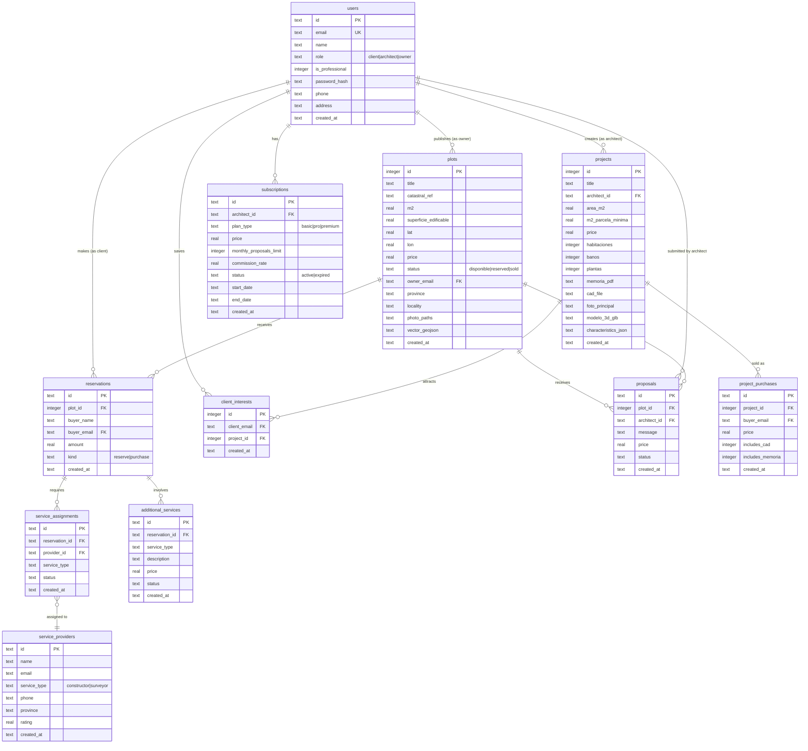

## Leyenda

### Tipos de relaciones
- `||--o{` : Uno a muchos (obligatorio a opcional)
- `}o--||` : Muchos a uno (opcional a obligatorio)

### Cardinalidades
- **users → plots**: Un propietario puede publicar muchas fincas
- **users → projects**: Un arquitecto puede crear muchos proyectos
- **users → reservations**: Un cliente puede hacer muchas reservas
- **plots → reservations**: Una finca puede tener muchas reservas (histórico)
- **projects → client_interests**: Un proyecto puede ser guardado por muchos clientes

### Estados de tablas
- **🟢 Activas con datos**: users, plots, projects, reservations, client_interests, architects, owners
- **🟡 Preparadas (vacías)**: proposals, subscriptions, payments, project_purchases, service_providers, service_assignments, additional_services
- **🔴 Legacy (deprecadas)**: proyectos, arquitectos, ventas_proyectos

### Notas de implementación
1. **Foreign Keys**: Actualmente no enforced en SQLite (usar PRAGMA foreign_keys=ON)
2. **Duplicación**: Tablas `architects` y `owners` duplican datos de `users`
3. **Email como FK**: Se usa email en vez de user_id en varios lugares (considerar cambio)
4. **Status tracking**: plots.status y reservations.kind controlan flujo de venta
